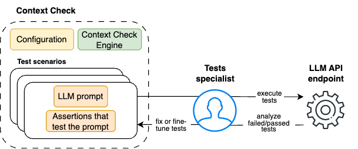

# LLM prompts validation 

An LLM prompt is a specific input or query provided to a language model to generate a response based on the model's training data.
ContextCheck provides an easy-to-use tool for fine-tuning and validating multiple prompts at once.

## LLM prompts validation process

The prompts testing workflow consists of the following steps:

1. **Choose an LLM:** Select the provider and model version you want to test your prompts with.

2. **Write test scenario(s).**

Each **test scenario** requires you to:

1. **Define LLM Prompts:** Create the prompts you want to test.

2. **Write Tests:** Create test assertions that verify the effectiveness of your prompts. These tests check if the model's responses meet your expectations.

3. **Execute Tests:** Run your tests to see which prompts pass or fail.

4. **Fine-Tune Prompts:** If any tests fail, adjust your prompts and re-run the tests. Repeat this process until all tests pass or you’re satisfied with the results.

ContextCheck allows you to execute individual or batch test scenarios.

You can test your prompts using either deterministic (rule-based) metrics, LLM-based metrics, or a combination of both, depending on your needs. 
To better understand the available metrics and how to use them, refer to the [metrics](../user_guide/metrics.md) documentation.

For technical details how to configure and write tests, refer to [How to configure test scenario](../user_guide/test_scenarios.md).

## Testing prompts across different models

Based on your particular requirements, you might want check how your prompts will perform against various LLM models.
Once scenario, or multiple scenarios, are ready you can switch LLM model and run tests against it.

The LLM landscape changes rapidly. When new models or model versions become available, and you want to test how they perform against your prompts, simply change test scenario configuration and execute you tests.

Note that in the case of prompt validation, not all LLM-based metrics are applicable. For example, the `hallucination` metric requires reference documents to verify if the answer is based solely on the reference or if it is fabricated.