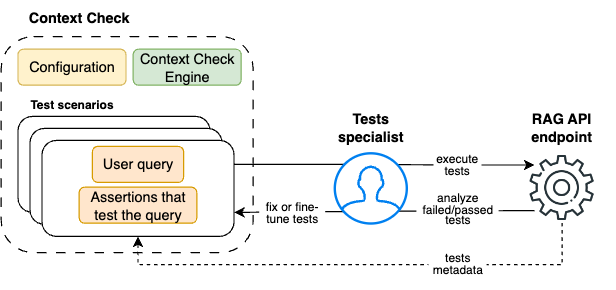

# RAG (Retrieval Augmented Generation) system validation

This scenario is similar to the "prompts validation" but instead of testing LLMs, the goal is to validate the performance of the RAG system API endpoint. 
ContextCheck sends a query to the API endpoint, receives a response from the RAG system, and validates that answer.

As the name suggests, RAG systems generate their answers based on the content retrieved from external sources or databases, combining retrieval and generation to provide more accurate and contextually relevant responses.

RAG systems can range from simple implementations that query a single document collection to complex architectures that integrate multiple knowledge sources, language models, and reasoning components, differing in their retrieval mechanisms, the sophistication of their knowledge integration, and their ability to perform multi-step reasoning or handle diverse types of information.

Depending on your needs, ContextCheck can test only the response from the RAG system or also examine its internal workings. 
For instance, using the `hallucination` metric, you can retrieve the reference documents the RAG system used to generate the response and ensure that no additional (hallucinated) information was introduced by the LLM. 

Currently, ContextCheck only supports fetching reference documents. However, future updates will enable users to extract and test inputs or outputs from any component of a RAG system. These features will be implemented with minimal changes required to the RAG system's codebase.

## RAG system validation process

The prompts testing workflow consists of the following steps:

1. **Configure:** Both ContextCheck and (depending on particular use-case) RAG system have to be configured. Refer to details in chapter [RAG Configuration](../user_guide/rag_configuration.md)

2. **Write test scenario(s).**

Each **test scenario** requires you to:

1. **Define queries:** Write queries that will be sent to your RAG system.

2. **Write Tests:** Create tests that verify the effectiveness of your queries. Additionally, you can use for your tests the RAG metadata, like for example documents that were pulled from RAG's database and used to generate the response. Similarly to LLM prompts testing process, these tests check if the model's responses meet your expectations. 

3. **Execute Tests:** Run your tests to see which queries pass or fail.

4. **Fine-Tune tests:** If any tests fail, adjust them accordingly and re-run. Repeat this process until all tests pass or you’re satisfied with the results.

### Test-driven RAG system development

The process described above enables a rigorous approach to making changes in the system. 
After introducing a change, you can run the entire test suite to check if it caused any regressions in other parts of the system.
When integrated with a CI/CD workflow, this process can protect the production environment from bugs or regressions. It ensures that changes are thoroughly tested before being deployed to production.

### Metrics

To write test assertions, you'll use specific, preconfigured metrics. ContextCheck implements both deterministic (rule-based) metrics and LLM-based metrics. 
When creating your tests, you can choose to use deterministic metrics, LLM-based metrics, or a combination of both, depending on your specific needs and the nature of your test scenarios.
To better understand the available metrics and how to use them, refer to the [metrics](../user_guide/metrics.md) documentation.

For technical details how to configure and write tests, refer to [How to configure test scenario](../user_guide/test_scenarios.md).